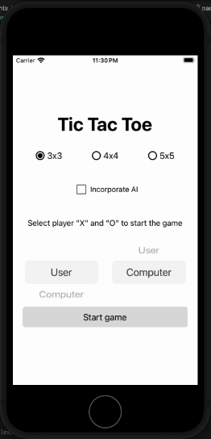

# Tic Tac Toe Game

This project is built with React Native, Expo and Typescript, and it was bootstrapped with [Expo CLI](https://docs.expo.dev/get-started/create-a-new-app/).

Tic Tac Toe is a simple game that provides the following options for player **_X_** and **_O_**:

- **_User .vs Computer_** - this is the default option where you, the user, play against the computer
- **_User .vs User_** - you play against yourself
- **_Computer .vs Computer_** - the computer plays against itself

You can also make the computer smart (unbeatable) by checking the "Incorporate AI" option.

## Run app

### `yarn install`

### `yarn start`

you can open iOS, Android, or web from here, or run them directly with the commands below:

`yarn android`

`yarn ios`

`yarn web`

---

## Run tests

to run all tests in watch mode: `yarn test`

to run all tests just once: `yarn testFinal`
